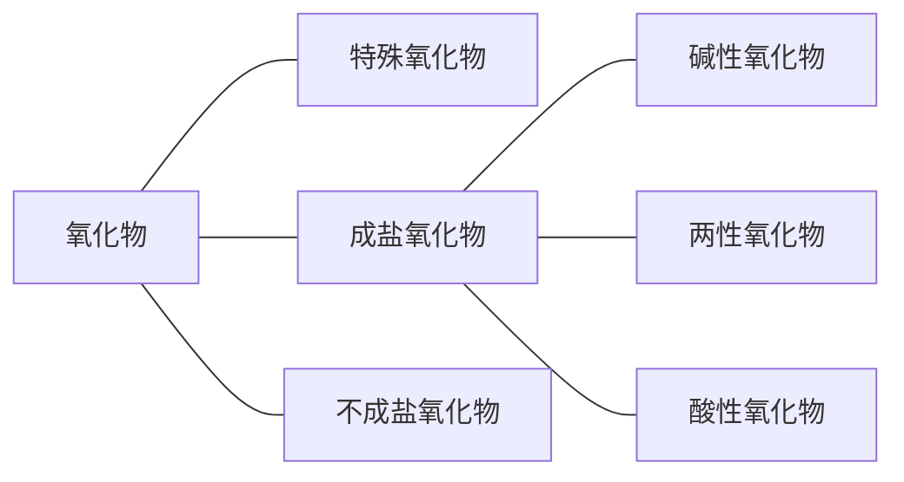

既能与酸反应又能与碱反应且都生成**盐和水**的氧化物叫**两性氧化物**。
只能与酸反应且生成**盐和水**的氧化物叫**碱性氧化物**。
只能与碱反应且生成**盐和水**的氧化物叫**酸性氧化物**。
既不能与酸反应也不能与碱反应生成**相应价态**的盐和水的氧化物叫**不成盐氧化物**。

*Note: 酸性氧化物一定有一个对应的酸（价态一致），碱性氧化物一定有一个对应的碱（价态一致），可依次判断。*

碱性氧化物一定是金属氧化物，但金属氧化物不一定是碱性氧化物。
酸性氧化物不一定是非金属氧化物，非金属氧化物也不一定是酸性氧化物。