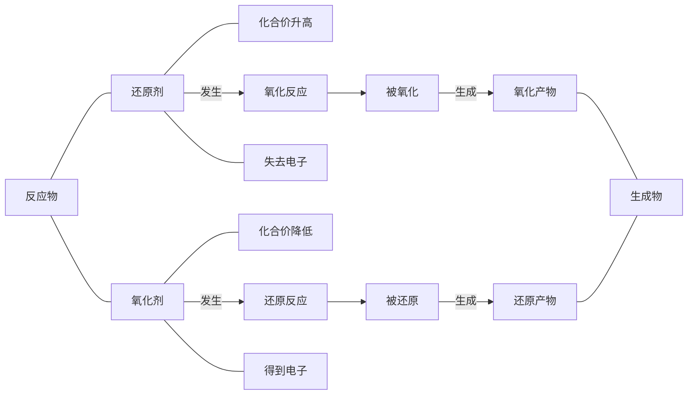

> 概念：元素化合价改变的反应。

其中，所含元素化合价升高的物质发生的反应为**氧化反应**，所含元素化合价降低的物质发生的反应为**还原反应**。

## 化合价改变的实质

从微观角度分析，化合价改变要么是发生了**电子的得失**，要么是发生了**电子对的偏移**。

举例说明：

**$\ce{Na}$ 与 $\ce{Cl2} 的反应$**

反应时 $\ce{Na}$ 原子失去一个电子，$\ce{Cl}$ 原子得到一个电子，这样双方最外层电子都达到了稳定结构。

反应中 $\ce{Na}$ 化合价升高，$\ce{Na}$ 被氧化；$\ce{Cl}$ 化合价降低，$\ce{Cl2}$ 被还原。

**$\ce{H2}$ 和 $\ce{Cl2}$ 的反应**

反应时，$\ce{H}$ 与 $\ce{Cl}$ 都需要获得一个电子才能形成稳定结构。但反应时没有发生电子对的得失，而是双方最外层电子都取一个电子形成共用电子对。同时由于 $\ce{Cl}$ 原子相对于 $\ce{H}$ 原子对于共用电子对的吸引力稍强，所以共用电子对更偏向于 $\ce{Cl}$ 离子。

反应中 $\ce{H}$ 化合价升高，$\ce{H2}$ 被氧化；$\ce{Cl}$ 化合价降低，$\ce{Cl2}$ 被还原。

**故微观角度下，失去电子的元素化合价升高，物质被氧化；得到电子的元素化合价降低，物质被还原。**

反应中失去电子的物质被称为**还原剂**，得到电子的物质被称为**氧化剂**。

**电子从还原剂转化到氧化剂。**

## 氧化性和还原性

> 氧化性是物质得电子的能力，还原性是物质失电子的能力。

处于高价态的物质一般具有氧化性，处于低价态的物质一般具有还原性。处于中间价态的物质一般兼具氧化性和还原性。

判断氧化性和还原性强弱：

- 在氧化还原反应中，氧化性：氧化剂 $>$ 氧化产物，还原性：还原剂 $>$ 还原产物。
- 金属单质活动性越强还原性越强，金属氧离子活动性越弱氧化性越强。

| $\ce{K}$  | $\ce{Ca}$  | $\ce{Na}$  | $\ce{Mg}$    | $\ce{Al}$    | $\ce{Zn}$    | $\ce{Fe}$    | $\ce{Sn}$    | $\ce{Pb}$    | ($\ce{H}$)  | $\ce{Cu}$    |                | $\ce{Hg}$    | $\ce{Ag}$  | $\ce{Pt}$ | $\ce{Au}$ |
| --------- | ---------- | ---------- | ------------ | ------------ | ------------ | ------------ | ------------ | ------------ | ----------- | ------------ | -------------- | ------------ | ---------- | --------- | --------- |
| $\ce{K+}$ | $\ce{Ca+}$ | $\ce{Na+}$ | $\ce{Mg^2+}$ | $\ce{Al^3+}$ | $\ce{Zn^2+}$ | $\ce{Fe^2+}$ | $\ce{Sn^2+}$ | $\ce{Pb^2+}$ | ($\ce{H+}$) | $\ce{Cu^2+}$ | ($\ce{Fe^3+}$) | $\ce{Hg^2+}$ | $\ce{Ag+}$ |           |           |

## 关系

**还原剂发生氧化反应，氧化剂发生还原反应。**

置换反应一定是氧化还原反应，分解反应和化合反应可能是氧化还原反应，复分解反应不可能是氧化还原反应。
