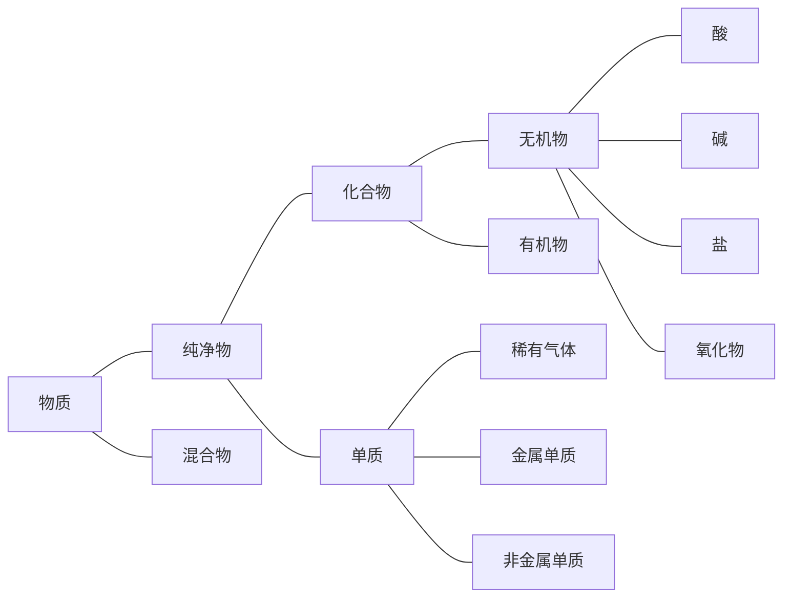

```mermaid
graph LR;
	Substance[物质] --- Pure[纯净物]
	Substance --- Mixture[混合物]
	Pure --- Compound[化合物]
	Pure --- Elementary[单质]
	Compound --- Inorganic[无机物]
	Compound --- Organic[有机物]
	Inorganic --- Acid[酸]
	Inorganic --- Alkali[碱]
	Inorganic --- Salt[盐]
	Inorganic --- Oxide[氧化物]
	Elementary --- NobleGases[稀有气体]
	Elementary --- Metal[金属单质]
	Elementary --- Nonmetal[非金属单质]
```

原子构成的物质：金属单质、稀有气体、固态非金属单质、溴($\ce{Br}$)。

分子构成的物质：大部分非金属单质、氧化物、**酸**。

**离子构成的物质：碱、盐。**
